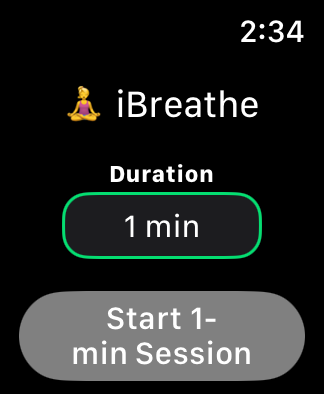
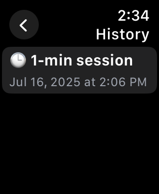
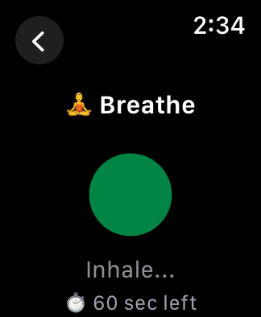
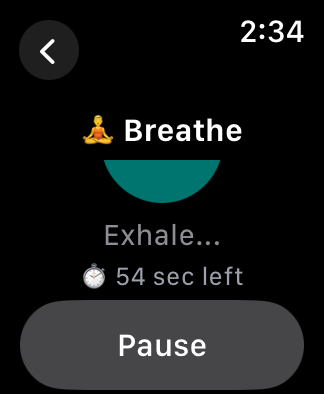
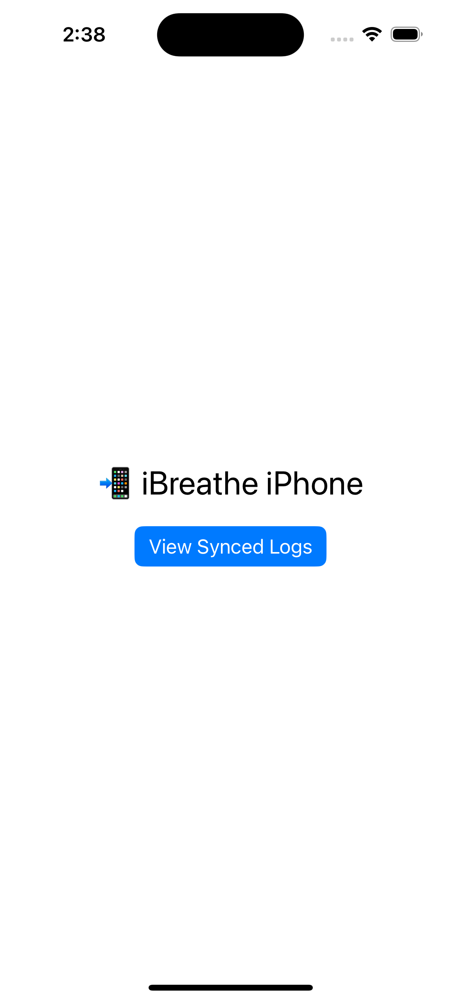

<h1 align="center">🧘‍♂️ iBreathe</h1>

<p align="center">
  <b>Mindful Breathing App for Apple Watch + iPhone</b><br>
  Guided breathing with haptics & synced session logs.
</p>

<p align="center">
  <a href="https://github.com/codeanurag/iBreathe">
    
    
    
  </a>
</p>

---

## 📋 Table of Contents

- [Features](#-features)
- [Tech Highlights](#-tech-highlights)
- [Screenshots](#-screenshots)
- [Setup & Run](#-setup--run)
- [Roadmap](#-roadmap)
- [Support](#-support)
- [Credits & License](#-credits--license)
---

## 🎯 Features

- Smooth inhale/exhale animation with haptic cues  
- Choose from 1, 3, or 5-minute sessions  
- Pause/resume mid-session  
- Session logs saved on Watch & automatically synced to iPhone  
- View session history on both devices

---

## 🔧 Tech Highlights

- SwiftUI for watchOS and iOS UI  
- WatchConnectivity (`WCSession`) for cross-device sync  
- Codable + FileManager for lightweight local persistence  
- MVVM architecture and shared `SessionLog` model

---

## 📸 Screenshots

### ⌚ Watch App

- 
- 
- 
- 

### 📱 iPhone App

- 

---

## 🧪 Setup & Run

> ⚠️ **Note:** Watch→iPhone sync only works on real paired devices. Simulators can test UI but not connectivity.

1. Clone the repo:  
   ```bash
   git clone https://github.com/codeanurag/iBreathe.git
   cd iBreathe
   ```

2. Organize files:
   ```
   iBreathe/
     ├── docs/
     │   ├── screen1.png
     │   ├── screen2.png
     │   ├── screen3.png
     │   ├── screen4.png
     │   └── screen5.png
     ├── iBreathe.xcodeproj
     └── README.md
   ```

3. Open in Xcode:
   ```bash
   open iBreathe.xcodeproj
   ```

4. Select your **iPhone + Apple Watch target**, build & run.

5. Start a breathing session on the Watch — logs will sync to iPhone automatically. View them in the “View Synced Logs” screen.

---

## 🚀 Roadmap

| Planned Feature          | Status     |
|--------------------------|------------|
| HealthKit integration    | ✅ Done |
| Custom inhale/exhale durations | ✅ Done |
| iCloud sync + Charts     | 🚧 In progress |
| Home Screen complication | 🛠 Planned |
| Widgets & notifications  | ❌ Not started |

---

## 📞 Support

Have questions or need help?

- 🐛 **Bug Reports**: [Open an issue](https://github.com/codeanurag/iBreathe/issues)
- 💡 **Feature Requests**: [Start a discussion](https://github.com/codeanurag/iBreathe/discussions)
- 📧 **Contact**: [codeanuragpandit@gmail.com](mailto:codeanuragpandit@gmail.com)

---  

## ❤️ Credits & License

Built with 💡 by [@codeanurag](https://github.com/codeanurag).  

Licensed under the MIT License — see [LICENSE](LICENSE) for details.
